**文章**：Yuan Yuan, Jingtao Ding, Jie Feng, Depeng Jin, and Yong Li. 2024. UniST: A Prompt-Empowered Universal Model for Urban Spatio-Temporal Prediction. In Proceedings of the 30th ACM SIGKDD Conference on Knowledge Discovery and Data Mining (KDD ’24), August 25–29, 2024, Barcelona, Spain. ACM, New York, NY, USA, 12 pages. https://doi.org/10.1145/3637528.3671662. Code:[https://github.com/tsinghua-fib-lab/UniST.](https://github.com/tsinghua-fib-lab/UniST)

试图提出一个基于LLM的通用城市时空预测模型。针对跨场景的不同时空数据扩展，使用时空提示词对齐跨场景的底层共享模式（不同场景的时空数据具有差异性）。

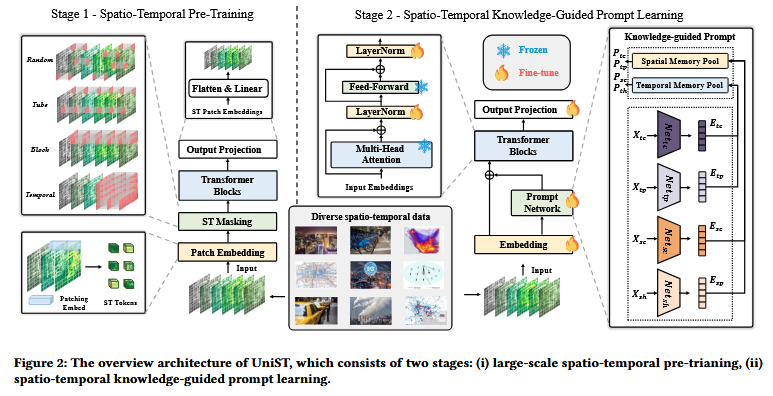


使用的是基于Transformer encoder-decoder结构的base model，将四维的时空数据 $X \in \mathbb{R}^{T×C×H×W}$ 按属性维度（通道维度C）划分为一串三维的tensor $x^{(c)} \in \mathbb{R}^{L×H×W}$ ，然后将其划分为patch，大小为(l,h,w)，并将patch使用卷积变换为一维token $E_x=Conv_{3d}(x^{(c)})$，从得到一串token序列。

encoder-decoder结构基于Masked Autoencoder(MAE)，采取了四种掩码策略，每次迭代随机选取一种掩码策略，增加数据多样性，提升模型泛化能力。
```python
mask_type = random.choice(["temporal", "spatial", "attribute", "joint"])
```

提出四个假设：
1. Spatial closeness(SC): Nearby units may influence each other.
2. Spatial hierarchy(SH): The spatial hierarchical organization impacts the spatio-temporal dynamics, requiring a multi-level perception on the city structure.
3. Temporal closeness(TC): Recent dynamics affect future results, indicating a closeness dependence.
4. Temporal period(TP): Daily or weekly patterns exhibit similarities, displaying a certain periodicity.

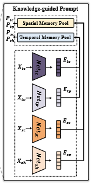


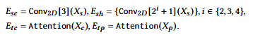


提示词生成，合并到transformer中进行联合学习。


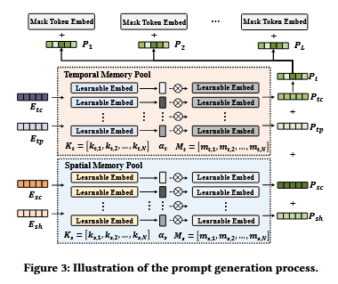


**文章**：Zijian Zhang, Xiangyu Zhao, Qidong Liu, Chunxu Zhang, Qian Ma, Wanyu Wang, Hongwei Zhao, Yiqi Wang, and Zitao Liu. 2023. PromptST: PromptEnhanced Spatio-Temporal Multi-Attribute Prediction . In Proceedings of the 32nd ACM International Conference on Information and Knowledge Management (CIKM ’23), October 21–25, 2023, Birmingham, United Kingdom. ACM, New York, NY, USA, 11 pages. https://doi.org/10.1145/3583780.3615016

针对的是多属性时空预测，提出基于LLM的泛化，自适应，可迁移模型，计算成本低。使用参数共享训练方法，设计了插入时空特征信息中的轻量级时空令牌，并集合了LLM的常识。（工程应用）


**文章**：Zhonghang Li, Lianghao Xia, Jiabin Tang, Yong Xu, Lei Shi, Long Xia, Dawei Yin, and Chao Huang. 2024. UrbanGPT: Spatio-Temporal Large Language Models. In Proceedings of the 30th ACM SIGKDD Conference on Knowledge Discovery and Data Mining (KDD ’24), August 25–29, 2024, Barcelona, Spain. ACM, New York, NY, USA, 12 pages. https://doi.org/10.1145/3637528.3671578. Code:[https://github.com/HKUDS/UrbanGPT](https://github.com/HKUDS/UrbanGPT)(假开源 :punch:)（针对zero-shot的工程应用）

**动机**

时空预测在洞察城市环境的动态变化上具有独特的优势，当前存在的问题主要有城市传感场景中的数据**具有高度的稀疏性**，以此训练出来的神经网络模型无法为下游任务提供准确的指导。

LLM在推理及抽象上具有独特的优势，希望借助大模型实现在**无标签或少标签**的情况下进行准确额时空预测，以实现不同场景下较高的模型泛化能力。

***核心立意是数据稀疏问题。***

先导实验，对比不同方法预测出租车流量预测结果
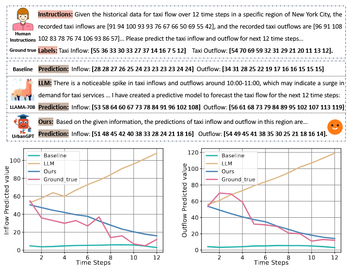


**基础概念**

1. 时空数据: 定义为 $X \in \mathbb{R}^{R × T × F}$ 是一个三维张量， $X_{r,t,f}$ 表示在区域r，时间t时第f个特征的值。

2. 时空预测：已知历史H个时间段的信息，预测未来P个时间段的数据：
   $$
   X_{t_{K+1}:t_{K+P}}=f(X_{t_{K-H+1}:t_{K}})
   $$
   包含两类预测预测任务：回归和分类。

3. 时空零样本学习：
   $$
   \hat{X}_{t_{K+1}:t_{K+P}}=\hat{f}(\hat{X}_{t_{K-H+1}:t_{K}})
   $$   
   模型 $\hat{f}$ 不是专门针对目标数据训练的。

**总体结构**
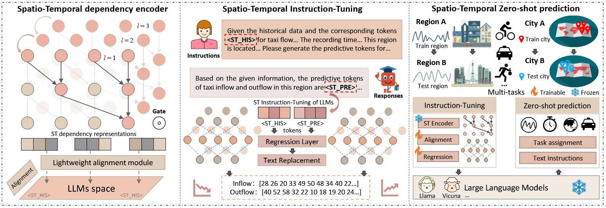


**时间编码器**

采用门控扩张卷积和多级相关注入层（说的太简单了），通过门控扩张卷积提取不同粒度下的时间特征，再通过多级相关注入层融合不同尺度的特征。

**时空文本对齐**

时间特征和空间特征的维度不同，通过轻量级映射模块将时空特征映射到相同的维度。（全连接层）轻量级

时空令牌：把“时空数据片段”变成类似文字 token 的向量，让 LLM 可以像读文字一样读懂时空数据。
类似如下方式：
```python
Token 1 = 0 点 A 区的 PM2.5+其它特征（映射成4096维）
Token 2 = 0 点 B 区......
Token 3 = 0 点 C 区......
...
Token 24 = 1 点 A 区......
...
Token 120 = 23 点 E 区......

```

**时空提示指令**

微调指令格式：
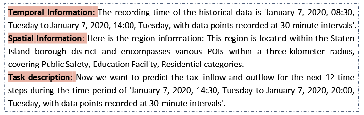


**时空指令微调**

生成预测令牌，然后通过回归层映射隐藏表示以生成更准确的预测值。监督微调

回归任务：

$$
\mathbf{Y}_{r,f} = \mathbf{W}_3 \left[ \sigma(\mathbf{W}_1 \mathbf{H}_{r,f}),\; \sigma(\mathbf{W}_2 \mathbf{\Gamma}_{r,f}) \right]
$$

，其中 $\mathbf{\Gamma}_{r,f}$ 作为新术语纳入LLM的词汇表中。

**损失函数**

采用了绝对误差损失所谓回归任务函数，
将分类任务的损失也纳入进来。联合损失。

**实验评估**

指标：回归任务采用MAE和RMSE，分类任务采用召回率和宏F1分数。

数据集：NYC-taxi，NYC-bike，NYC-crime，跨城市预测采用了CHI-taxi

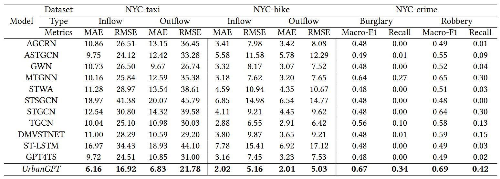


**案例研究**

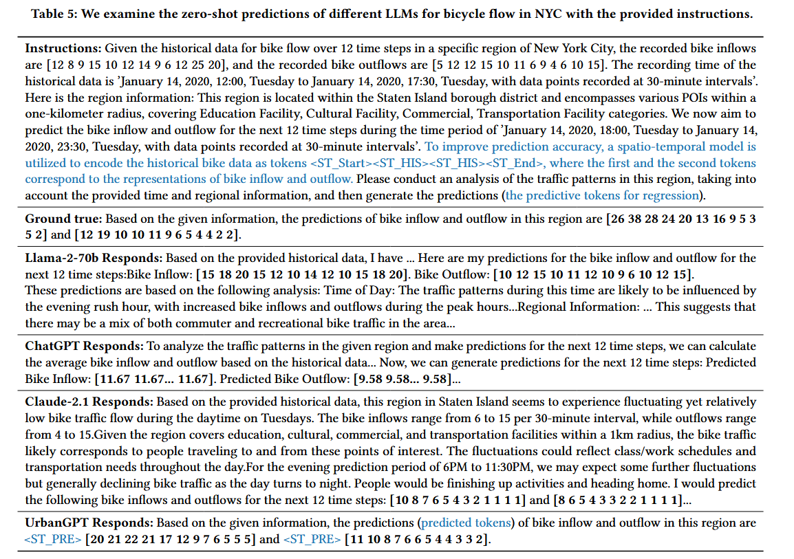


**总结**

1. 没有本质创新，采用了门控扩张卷积和多级相关性注入层联合提取时空潜在特征。
2. 针对时空预测这个新问题提出全新LLM框架。尤其是zero-shot和few-shot场景。
3. 其他的更多的是现有成熟技术的整合。

**文章**：Yuhang Liu, Yingxue Zhang, Xin Zhang, Ling Tian, Yanhua Li, and Jun Luo. 2025. UrbanMind: Urban Dynamics Prediction with Multifaceted Spatial-Temporal Large Language Models. In Proceedings of the 31st ACM SIGKDD Conference on Knowledge Discovery and Data Mining V.2 (KDD ’25), August 3–7, 2025, Toronto, ON, Canada. ACM, New York, NY, USA, 12 pages. https://doi.org/10.1145/3711896.3737177，code:[https://github.com/Yliu1111/UrbanMind](https://github.com/Yliu1111/UrbanMind)（假开源，代码缺失多个文件）

要解决的问题：
1. 多源异构时空数据。 
2. **训练数据和测试数据的分布差异**。
3. **不同城市场景的泛化**。
4. 可解释性。

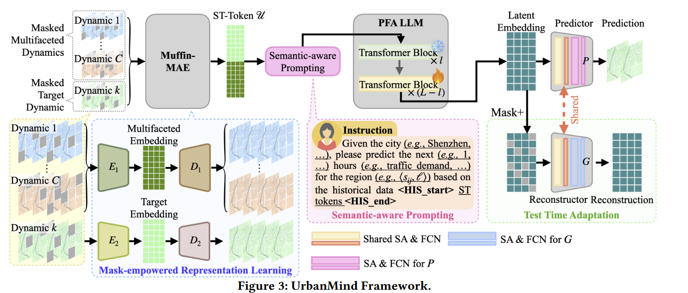


使用了和UniST相似的MAE掩码自编码器结构，采用了三种**掩码策略**：
1. 通道敏感的空间掩码策略， $|\mathcal{M}_{\text{spatial}}|=p_s\cdot l^2$
   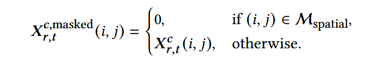
   
2. 通道敏感的时间掩码策略，
   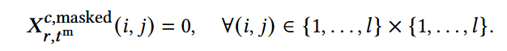
   
3. 全局掩码策略。 $|\mathcal{M}_{\text{spatial}}|=p_s\cdot C \cdot l^2$
   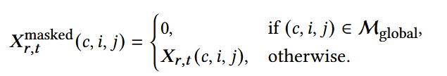
   

将当前的多面数据和目标城市的时空变量联合嵌入得到ST-Token

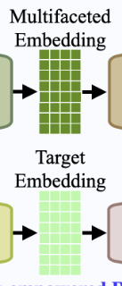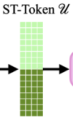


通过**语义感知提示词模块**将ST-Token封装到结构化提示词中，具体的过程和实现没有说，只有一个模块图。

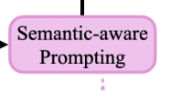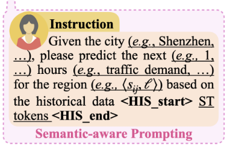


**微调策略**直接照搬了[Spatial-temporal large language model for traffic prediction](https://arxiv.org/abs/2401.10134)的PFA LLM模块

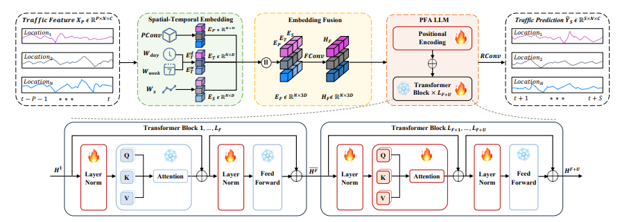


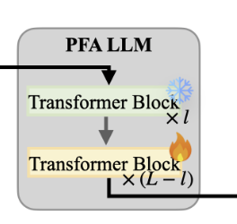
