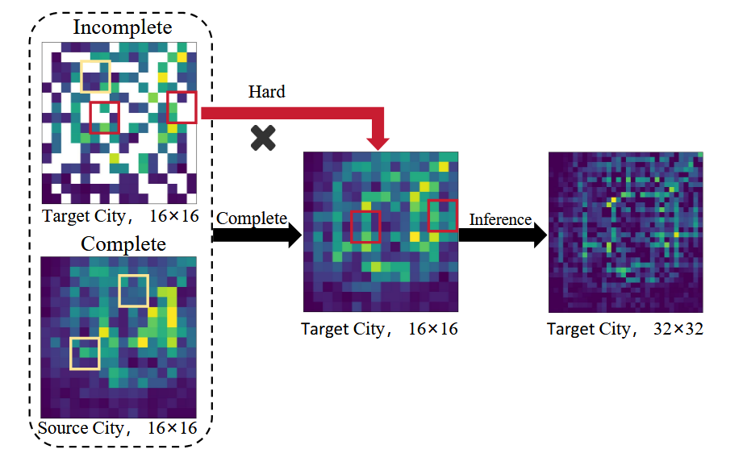

## 细粒度城市流推理

从粗粒度的城市数据中推断细粒度的城市推理。

### 当前已经研究的问题

#### 跨城市场景

1. 在高度缺失率的场景下，如何使用超分辨率技术进行跨城市的细粒度推理（**存在的问题是，高缺失率如何界定，已有文章将缺失率按百分比进行了界定和划分**）

2. 跨城市场景中，如何将多个具有分布数据的城市知识迁移到稀疏的目标城市中，从而指导稀疏目标城市的细粒度城市推理（**存在的问题是。。。**）

#### 单城市场景

1. 同样针对不完全数据，已知多粒度的粗粒度时空数据，如何据此推断多粒度的细粒度时空数据，即多任务推理（**存在的问题是。。。**）
