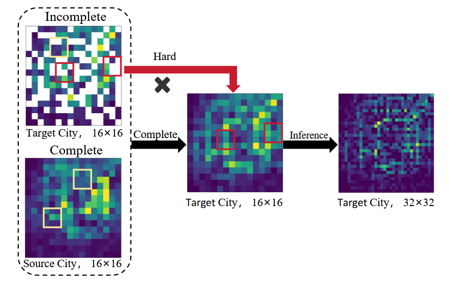

## 细粒度城市流推理

从粗粒度的城市数据中推断细粒度的城市推理。

### 当前已经研究的问题

1.数据不完整，2.数据不可靠，3.需融合外部知识

#### 跨城市场景

1. 在高度缺失率的场景下，如何使用超分辨率技术进行跨城市的细粒度推理（**存在的问题是，高缺失率如何界定，已有文章将缺失率按百分比进行了界定和划分**）

2. 跨城市场景中，如何将多个具有分布数据的城市知识迁移到稀疏的目标城市中，从而指导稀疏目标城市的细粒度城市推理（**存在的问题是迁移的资源消耗等问题**）领域知识的不充分融合&迁移学习中城市差异大而引起的负迁移风险。

3. 跨城市场景中，灾难性遗忘问题，如何使用自适应**知识重放**持续学习的方式。存储旧城市的所有知识造成存储资源消耗大，在旧城市训练好的模型上微调以适应新城市容易造成灾难性遗忘。旧知识在反向传播的过程中随着不断的微调会被遗忘

#### 单城市场景

1. 同样针对不完全数据，已知多粒度的粗粒度时空数据，如何据此推断多粒度的细粒度时空数据，即多任务推理（**存在的问题是。。。**）

2. 针对稀疏不完整和含噪声数据，**不假设收集到的粗粒度城市流是可靠的**，融合外部知识，提取复杂动态的时空数据依赖性并进行细粒度城市流推断（**通过这篇文章的一个想法是是否能结合静态和动态两种图联合建模时空动态时空依赖进行数据补全和细粒度推断，之前在时空预测领域已经有相关工作似乎可以迁移想法**）

3. 越来越复杂的网络以及网络参数的数量越来越庞大，传统损失函数（如MSE等）平等的对待所有的误差，没有充分考虑时空数据所具有的**高度倾斜性（如长尾分布，幂次分布等）和分布不均**的特性，提出轻量化模型以及新的损失函数（优化策略）。

4. 将路网信息作为先验知识，以其作为引导来感知空间分布，而不是将其作为外部因素（**是否可以考虑功能区划，POI等引导&作为先验知识来感知时空分布情况**）

#### 图像超分辨率重建

旨在从低分辨率图像生成高分辨率图像。使用CNN，残差网络，相关邻居回归等方法学习低分辨率图像和高分辨率图像间的映射关系。但是这些方法难以直接应用在细粒度城市流推断任务中。